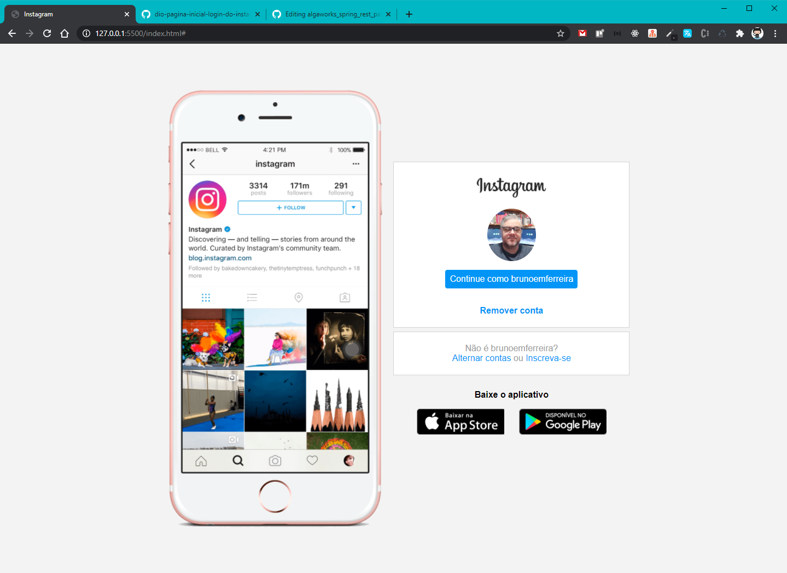
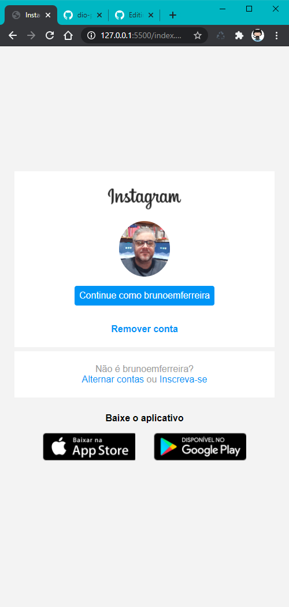

> <h1>Clone página inicial de login do Instagraam</h1>

> <h2>Sobre o Projeto</h2>

<!-- ************************************* Baadges ********************************************* -->

  

 

  

Nesse projeto você terá o desafio de reconstruir a página inicial de login do Instagram, no qual será abordado o conceito sobre CSS utilizando Flexbox, uma metodologia de posicionamento de elementos em tela mais utilizada no mercado assim como conceitos de responsividade.

CSS

> <h2>Imagens do Projeto</h2>

 
   
   

> <h2>Ferramentas e Linguagens</h2>

- VSCode
- HTML
- CSS
- Flexbox

> <h2></h2>
